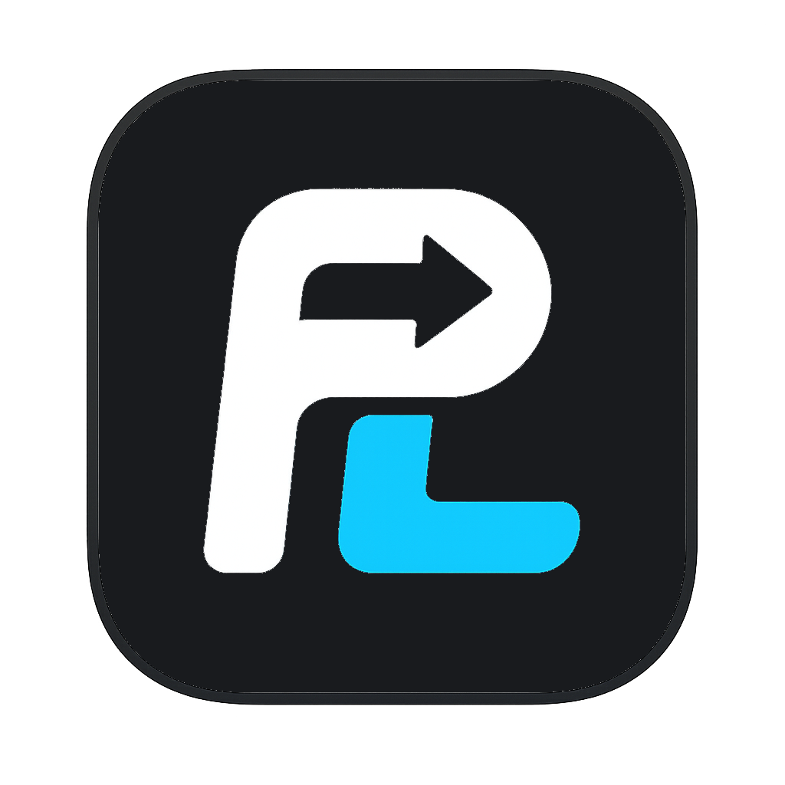
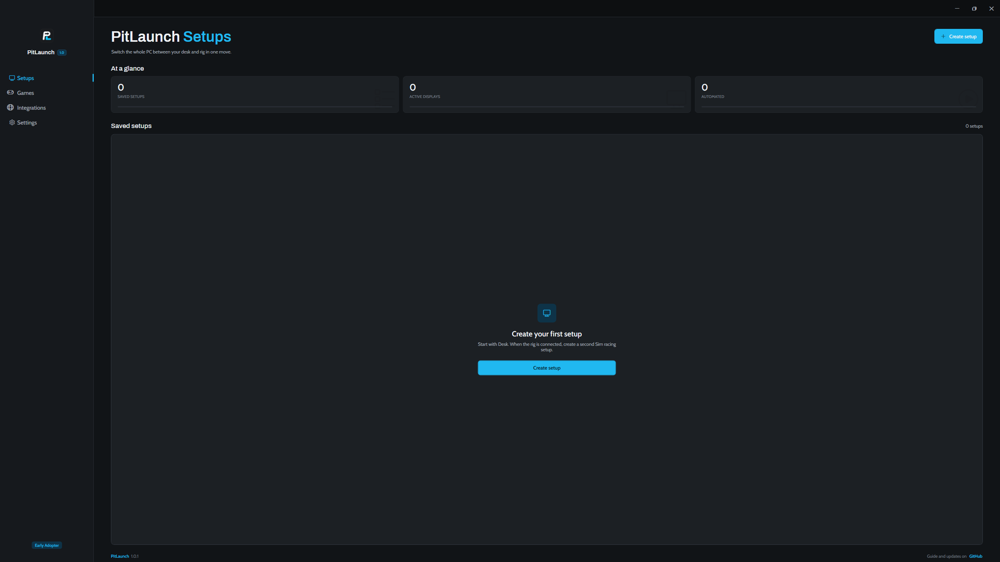
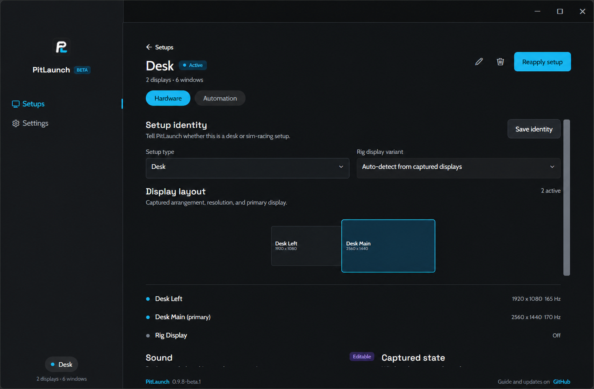
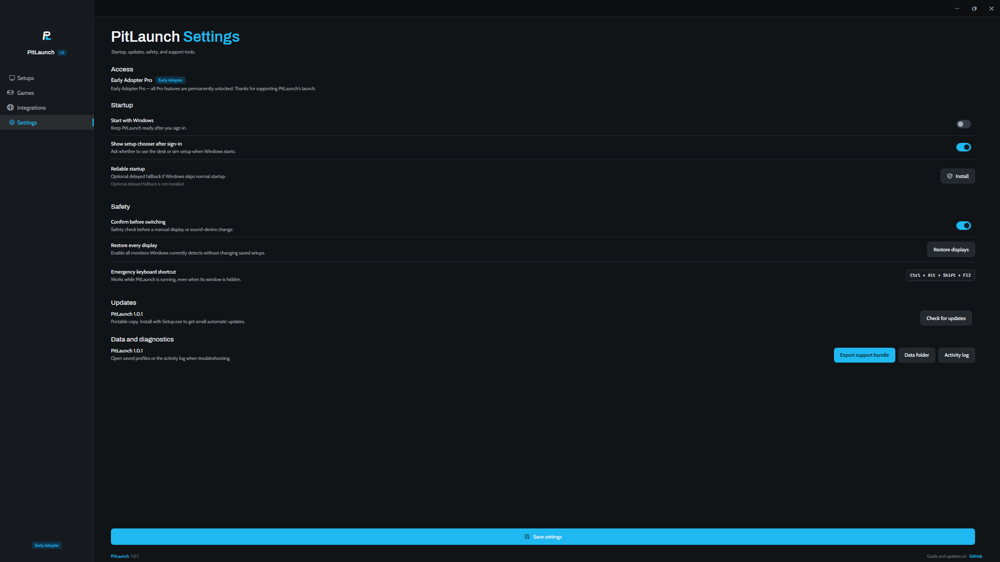

<div align="center">



# PitLaunch

**Switch one Windows PC between your desk and sim rig—displays, audio, windows, apps, and session hardware—in one safe move.**



<p>
  
  
</p>

</div>

## What it does

- Captures Desk and Sim Racing display layouts, including the primary screen, resolution, refresh rate, and position.
- Switches playback, microphone, per-app output and volume, power plan, HDR preference, and sleep prevention.
- Restores window positions and launches apps in a chosen order with delays and readiness checks.
- Detects configured games even when they start outside PitLaunch, then applies game-specific app, audio, volume, and Discord overrides.
- Checks expected controllers before a session and exposes setup, toggle, status, and display-recovery actions to Stream Deck.
- Keeps manual switches deliberate while automatic game, hotkey, CLI, and Stream Deck switches remain prompt-free.
- Provides preflight checks, restart-safe Undo, rollback, and an emergency display-recovery shortcut.
- Stores setups locally. No account and no telemetry.

## How it compares

| Best fit when you need… | PitLaunch | DisplayMagician | SimLauncher |
|---|---|---|---|
| Whole-PC Desk ↔ Rig switching: displays, audio, window positions, apps, hardware readiness, game detection, Discord, Stream Deck, safety and recovery | **Strongest fit** | Display-first workflow | Launcher-first workflow |
| NVIDIA Surround / AMD Eyefinity / cloned displays and unusual display hardware | Windows-visible layouts only | **Strongest fit** | Different focus |
| A large game/companion launcher: 27 sims, drag-to-reorder and launch delays | Game presets, not a 27-sim catalog | Different focus | **Strongest fit** |

**DisplayMagician** is stronger for NVIDIA Surround, AMD Eyefinity, cloned displays, and unusual display hardware. **SimLauncher** is stronger as a large game and companion-app launcher, with 27 sims, drag-to-reorder, and launch delays. **PitLaunch** is the whole-PC Desk ↔ Rig switcher: displays, audio, window positions, apps, hardware readiness, game detection, Discord, Stream Deck, safety, and recovery move as one setup.

PitLaunch 1.0 behavior in this comparison was verified locally on the launch machine. Competitor strengths are fair summaries of their official documentation and were not hardware-tested here. See the source notes in [docs/COMPETITOR-NOTES.md](docs/COMPETITOR-NOTES.md); “Different focus” does not mean unsupported or unreliable.

## Download

[](https://github.com/Cevzom/PitLaunch/releases/latest/download/PitLaunch-win-Setup.exe)

- [Windows installer](https://github.com/Cevzom/PitLaunch/releases/latest/download/PitLaunch-win-Setup.exe) — self-updating, no administrator access required.
- [Portable ZIP](https://github.com/Cevzom/PitLaunch/releases/latest/download/PitLaunch-win-Portable.zip) — runs without installation and does not auto-update.
- [Stream Deck plugin](https://github.com/Cevzom/PitLaunch/releases/latest/download/com.cevzom.pitlaunch.streamDeckPlugin) — can also be installed from **PitLaunch → Integrations**.

Windows 10/11 x64 · .NET included · MIT licensed

### Windows SmartScreen

PitLaunch 1.0 is not code-signed yet, so SmartScreen may warn on first launch. Choose **More info → Run anyway** only after verifying that you downloaded the file from the official release above.

### Verify the SHA256

Every release includes a SHA256 table and a downloadable `SHA256SUMS.txt`. In PowerShell, from the download folder:

```powershell
Get-FileHash .\PitLaunch-win-Setup.exe -Algorithm SHA256
Get-Content .\SHA256SUMS.txt
```

The hash beside `PitLaunch-win-Setup.exe` must match exactly. The portable ZIP and update packages are listed in the same file.

## Documentation

- [User guide — Hebrew and English](docs/USER-GUIDE.md)
- [Complete feature list](docs/FINAL-FEATURES.md)
- [Competitor research and launch-thread replies](docs/COMPETITOR-NOTES.md)
- [Release process](docs/RELEASING.md)
- [Design notes](docs/DESIGN.md)
- [Contributing](CONTRIBUTING.md)

## License

[MIT](LICENSE) © 2026 Cevzom
